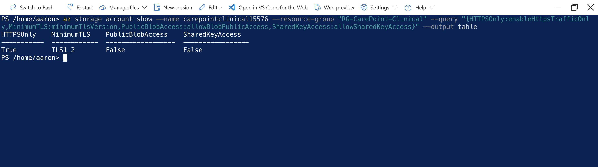
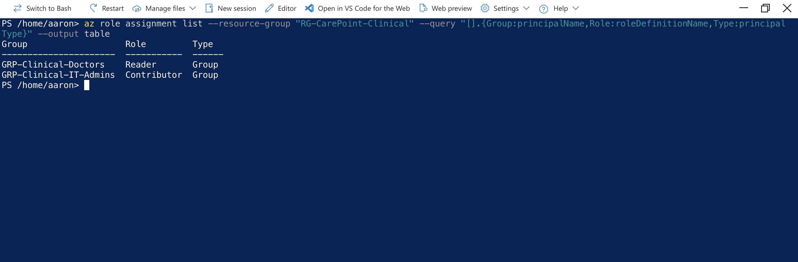
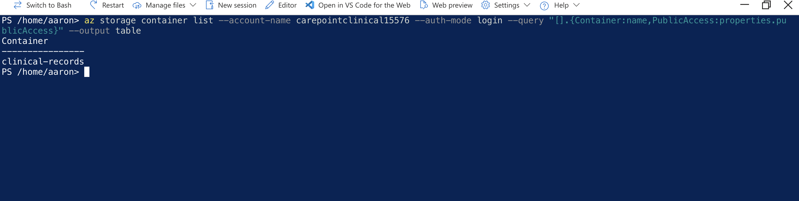
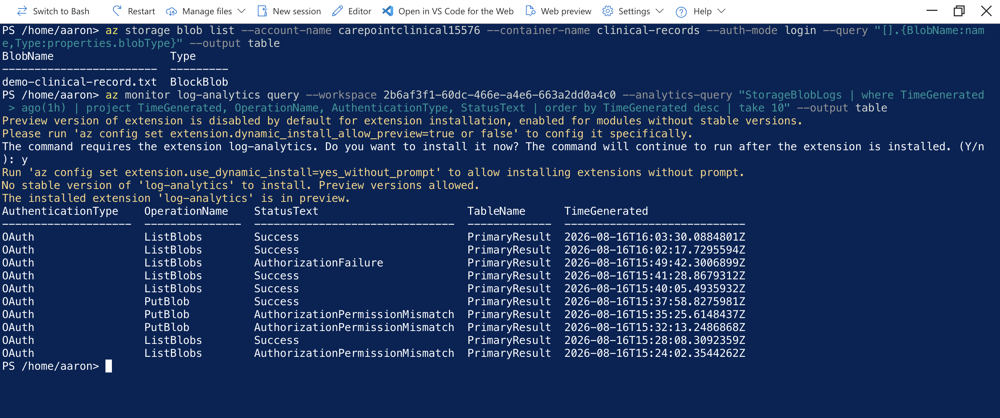
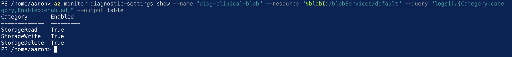
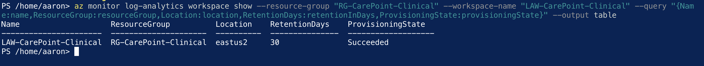

# CarePoint Clinical - Azure Security Project

## Project Overview

CarePoint Clinical is a fictional healthcare organization I used to build a hands-on Azure security environment.

The goal of this project was to practice securing cloud storage and controlling access to sensitive clinical data. I configured the environment so I could test both successful and denied access attempts and then review those events through Azure monitoring.

## What I Worked On

- Created and configured an Azure Storage Account
- Used Azure role-based access control (RBAC) to manage permissions
- Worked with Storage Blob Data Reader and Storage Blob Data Contributor roles
- Restricted network access to the storage account
- Disabled public blob access
- Enforced HTTPS-only traffic and TLS 1.2
- Verified encryption settings
- Tested successful and failed authorization attempts
- Used Azure Log Analytics to review storage activity

## Tools Used

Microsoft Azure | Azure Storage | Microsoft Entra ID | Azure RBAC | Log Analytics | Azure CLI | PowerShell

## What I Learned

This project gave me practical experience with cloud permissions, storage security, network restrictions, and monitoring. I also got experience troubleshooting access problems and using logs to understand why requests were allowed or denied.
  ## Project Evidence

### 1. Storage Security Configuration

### 2. RBAC Role Assignments

### 3. Clinical Records Container

### 4. RBAC Access Testing

### 5. Diagnostic Logging

### 6. Log Analytics Workspace

